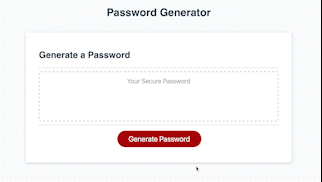

# module-three-challenge

## Description

This project was meant to create a randomized password generator with input from the User using javascript. This project reaffirmed my knowledge of basic javascript funtions, loops, and user input methods.

This randomized password generator was built with javascript, after being given the html and css files. This was done to solely focus on and demonstrate the information learned in the week 3 Basic JS Lectures.


<!-- Provide a short description explaining the what, why, and how of your project. Use the following questions as a guide:

- What was your motivation?
- Why did you build this project? (Note: the answer is not "Because it was a homework assignment.")
- What problem does it solve?
- What did you learn? -->

## Table of Contents (Optional)

<!-- If your README is long, add a table of contents to make it easy for users to find what they need. -->

- [Installation](#installation)
- [Usage](#usage)
- [Credits](#credits)
- [License](#license)
- [Badges](#badges)
- [Features](#features)
- [Tests](#tests)

## Installation

There is no installation required for this ramdomized Password Generator. Simply follow this [link](https://abbeydoyle.github.io/module-three-challenge/), open in your preferred browser, and begin generating your own randomized passwords.

<!-- What are the steps required to install your project? Provide a step-by-step description of how to get the development environment running. -->


## Usage

There are 4 main sections of this repository:

- [Develop Folder](https://github.com/abbeydoyle/module-three-challenge/tree/main/Develop) - Contains the [CSS Styling Sheet](https://github.com/abbeydoyle/module-three-challenge/blob/main/Develop/style.css), the [JS file](https://github.com/abbeydoyle/module-three-challenge/blob/main/Develop/script.js), a [JS graveyard file](https://github.com/abbeydoyle/module-three-challenge/blob/main/Develop/graveyard.js), where outdated JS is stored for future reference, and an [images folder](https://github.com/abbeydoyle/module-three-challenge/blob/main/Develop/images)

- [HTML](https://github.com/abbeydoyle/module-three-challenge/blob/main/index.html) - Contains the HTML encoding the Password Generator

- [License](https://github.com/abbeydoyle/module-three-challenge/blob/main/LICENSE) - Contains the webpage license

- [ReadMe](https://github.com/abbeydoyle/module-three-challenge/blob/main/README.md) - This file containing an executive overview of the project

 


<!-- Provide instructions and examples for use. Include screenshots as needed.

To add a screenshot, create an `assets/images` folder in your repository and upload your screenshot to it. Then, using the relative filepath, add it to your README using the following syntax:

    ```md
    
    ``` -->

## Credits

This webpage was built using UW Trilogy Bootcamp class materials as references.

I received emotional support throughout this project by my classmate, Matthew Townsend.

## License

MIT License

Copyright (c) 2022 abbeydoyle

Permission is hereby granted, free of charge, to any person obtaining a copy of this software and associated documentation files (the "Software"), to deal in the Software without restriction, including without limitation the rights to use, copy, modify, merge, publish, distribute, sublicense, and/or sell copies of the Software, and to permit persons to whom the Software is furnished to do so, subject to the following conditions:

The above copyright notice and this permission notice shall be included in all copies or substantial portions of the Software.

THE SOFTWARE IS PROVIDED "AS IS", WITHOUT WARRANTY OF ANY KIND, EXPRESS OR IMPLIED, INCLUDING BUT NOT LIMITED TO THE WARRANTIES OF MERCHANTABILITY, FITNESS FOR A PARTICULAR PURPOSE AND NONINFRINGEMENT. IN NO EVENT SHALL THE AUTHORS OR COPYRIGHT HOLDERS BE LIABLE FOR ANY CLAIM, DAMAGES OR OTHER LIABILITY, WHETHER IN AN ACTION OF CONTRACT, TORT OR OTHERWISE, ARISING FROM, OUT OF OR IN CONNECTION WITH THE SOFTWARE OR THE USE OR OTHER DEALINGS IN THE SOFTWARE.

<!-- The last section of a high-quality README file is the license. This lets other developers know what they can and cannot do with your project. If you need help choosing a license, refer to [https://choosealicense.com/](https://choosealicense.com/). -->

---

<!-- 🏆 The previous sections are the bare minimum, and your project will ultimately determine the content of this document. You might also want to consider adding the following sections. -->

## Badges


<!-- 

Badges aren't necessary, per se, but they demonstrate street cred. Badges let other developers know that you know what you're doing. Check out the badges hosted by [shields.io](https://shields.io/). You may not understand what they all represent now, but you will in time. -->

## Features

This page features user input for:

- alert messages
- password length
- character types including: upper and lower case letters, special characters, and numbers


<!-- If your project has a lot of features, list them here. -->

<!-- ## How to Contribute

If you created an application or package and would like other developers to contribute it, you can include guidelines for how to do so. The [Contributor Covenant](https://www.contributor-covenant.org/) is an industry standard, but you can always write your own if you'd prefer. -->

## Tests

This randomized password generator will only allow a password length of 8-128 characters. Test this out by inputting a number outside of this range.

This generator will generate a password with any character type combination. Test it out with the user input prompts.

This generator requires the user to select at least one character type. Test out this feature by choosing 'cancel' on every character type input.

<!-- Go the extra mile and write tests for your application. Then provide examples on how to run them here. -->